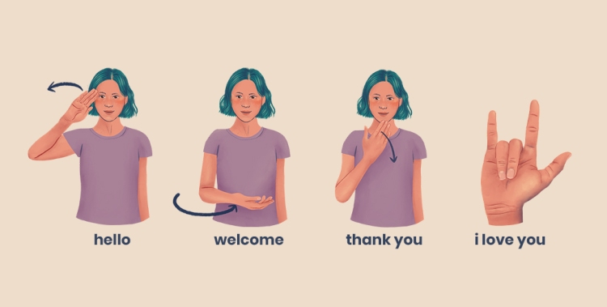

# Assessment and Implementation of a Real-Time Sign Language Recognition Framework Using Computer Vision
This project leverages machine learning algorithms, including Ultralytics, PyTorch, TensorFlow, OpenCV, and NVIDIA’s CUDA, to detect and classify hand gestures representing sign language in natural image scenes.


## Overview and Background
Recognizing sign language in real time represents one of the most impactful applications of modern computer vision and deep learning. The task involves detecting the hands and body posture of a signer from a live video stream, interpreting their gestures, and translating them into meaningful text or speech. Unlike static object detection, this process demands high temporal precision, gesture segmentation, and adaptability to variations in lighting, skin tones, and hand orientation.

Across the globe, over 70 million deaf and hard-of-hearing individuals rely on sign language as their primary means of communication (World Federation of the Deaf, 2023). However, accessibility barriers persist, especially in education, customer service, and healthcare, where real-time human interpreters are not always available. By enabling computers to interpret sign language directly, we can dramatically reduce communication gaps and foster inclusivity across digital and physical environments.


## Table of Contents
```
sign-language-understanding
|__ images
|   |__ general_image.png 
|   |__ demo.jpg
|__ src
    |__ gesture_collage_generator.py
    |__ gesture_data_collector.py
    |__ gesture_image_flipper.py
    |__ hand_histogram_creation.py
    |__ inference_final.py
    |__ pickle_gesture_dataset.py
    |__ train_cnn_model.py
README.md
requirements.txt
LICENSE
```

## Getting started

### Resources used
A high-performance Acer Nitro 5 laptop equipped with an Intel Core i7 processor and an NVIDIA GeForce GTX 1650 GPU (4 GB VRAM) was used for model training and testing. Because the dataset used for training is relatively small and designed for demonstration purposes, the training process was completed extremely quickly—typically taking around one minute per model. This configuration offered a smooth and efficient workflow, allowing rapid experimentation and real-time validation of gesture-recognition results.

### Installing
The project is deployed in a local machine, so you need to install the next software and dependencies to start working:

1. Create and activate the new virtual environment for the project

```bash
conda create -n sign_language python=3.11
conda activate sign_language
```

2. Clone repository

```bash
git clone https://github.com/rafamartinezquiles/sign-language-understanding.git
```

3. In the same folder that the requirements are, install the necessary requirements

```bash
cd sign-language-understanding
pip install -r requirements.txt
```

### Execution
Before capturing or recognizing gestures, you must generate a hand color histogram that allows the system to detect your skin tone in the video feed.

```bash
python src/hand_histogram_creation.py
```

When you run the script, a webcam window will open displaying a green Region of Interest (ROI) box on the screen. Place your hand inside this box, ensuring that the lighting and color appear consistent and accurate. Once your hand is positioned correctly and the image looks clear, press C on your keyboard to capture the hand color histogram. After successfully capturing it, press S to save the histogram and exit the application.

Next, capture your own sign language gestures using your webcam.

```bash
python src/gesture_data_collector.py
```

When you run the script, it will first prompt you to enter a gesture ID (a numeric value) and a gesture label (a descriptive text name for the gesture). After that, the webcam will start capturing frames of your hand performing the gesture. These captured images are automatically saved in the gestures/ directory, organized by their corresponding gesture ID. At the same time, the script records the gesture information, such as its ID and label—into the local database file gesture_db.db, ensuring that each gesture is properly registered and easy to reference later during training or inference. Also, as we don't have that many images, we can increase the diversity of your dataset by horizontally flipping existing gesture images.

```bash
python src/gesture_image_flipper.py
```

This script duplicates each image and creates mirrored versions to improve model robustness. Once we have all ready, why don't we prepare the dataset for training? Let's split all the gesture images into training, validation, and test sets.

```bash
python src/pickle_gesture_dataset.py
```

In this step, the script loads all the captured gesture images from the dataset and automatically shuffles them to ensure randomness during training. It then divides the images into separate sets for training, validation, and testing, providing a balanced distribution for model evaluation. Finally, the processed data is saved as .pkl (pickle) files, which allow for faster and more efficient loading when training the neural network model.

Now that your dataset is ready, you can move on to visualization, training, and real-time gesture recognition. To preview all captured gestures in a single collage image, simply run:

```bash
python src/gesture_collage_generator.py
```

This script will generate and display a grid-style collage containing randomly sampled gesture images for each label, allowing you to visually confirm that your data has been collected and organized correctly. It’s an excellent way to quickly inspect dataset quality and consistency before moving on to model training. Next, let’s train the Convolutional Neural Network (CNN) using your prepared dataset:

```bash
python src/train_cnn_model.py
```

During this stage, the model will learn to recognize different gestures by analyzing patterns from the training data. The training process automatically validates the model’s accuracy and saves the best-performing version as cnn_model_keras2.h5 inside the src/ folder. You’ll also see live progress updates—such as training loss and validation accuracy—displayed directly in the console. Finally, it’s time to run the real-time gesture recognition system:

```bash
python src/inference_final.py
```

Once launched, your webcam will open, and you’ll be able to interact with two powerful modes:

- **Text Mode:** Detects and speaks recognized words using your trained CNN model.
- **Calculator Mode:** Interprets gestures as numbers and arithmetic operators, performing live mathematical operations.

Use the following keyboard shortcuts to control the system:

| Key   | Action                       |
| ----- | ---------------------------- |
| **t** | Switch to Text Mode          |
| **c** | Switch to Calculator Mode    |
| **v** | Toggle voice feedback on/off |
| **q** | Quit the application         |


